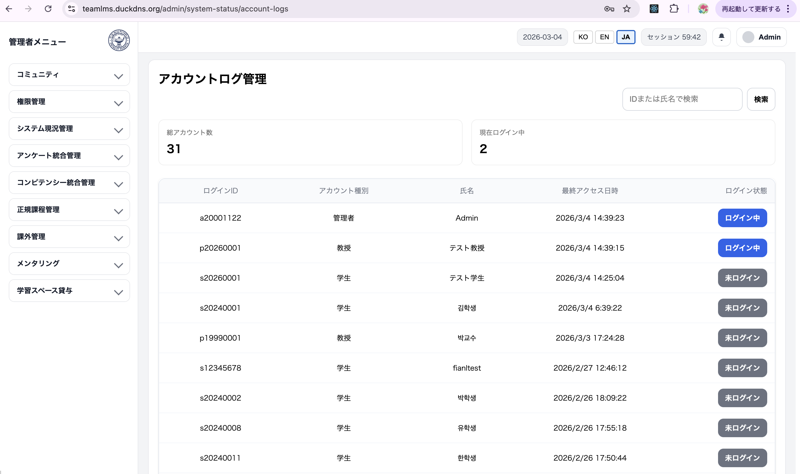
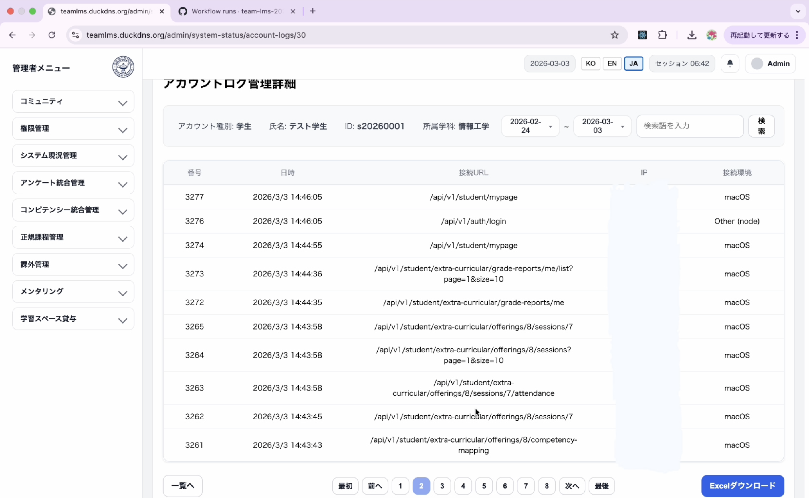
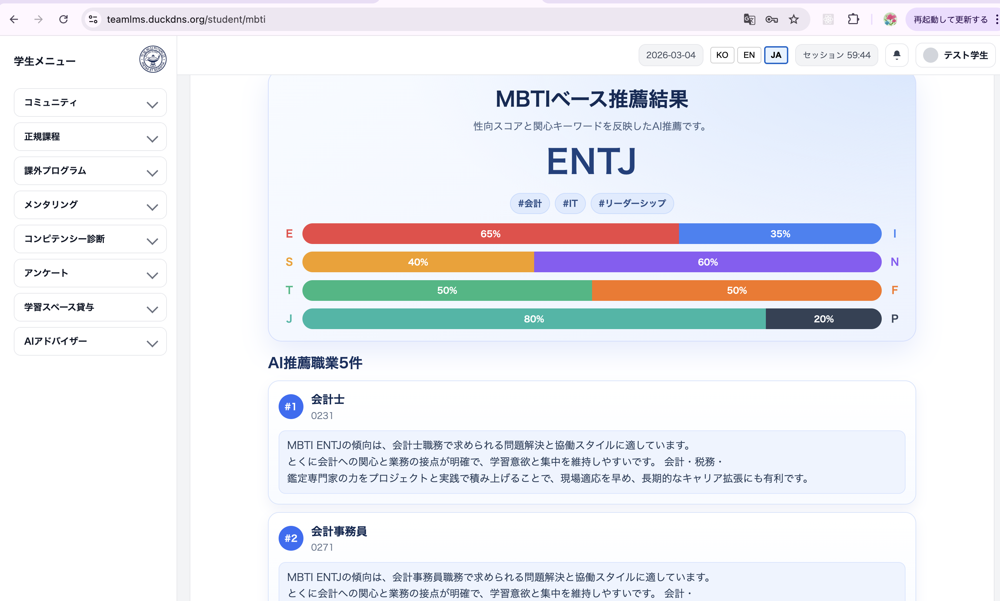
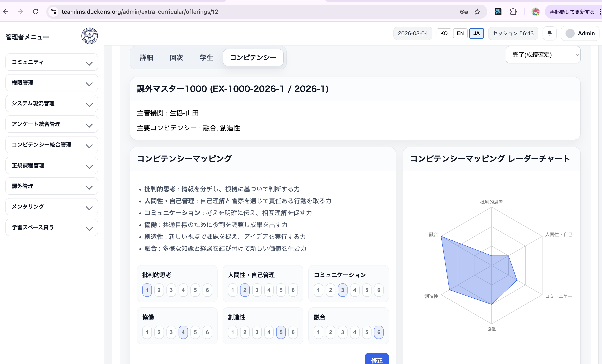
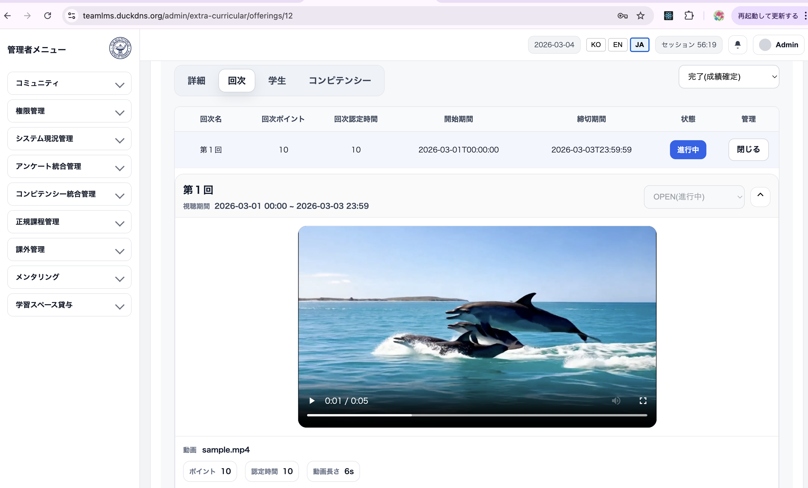
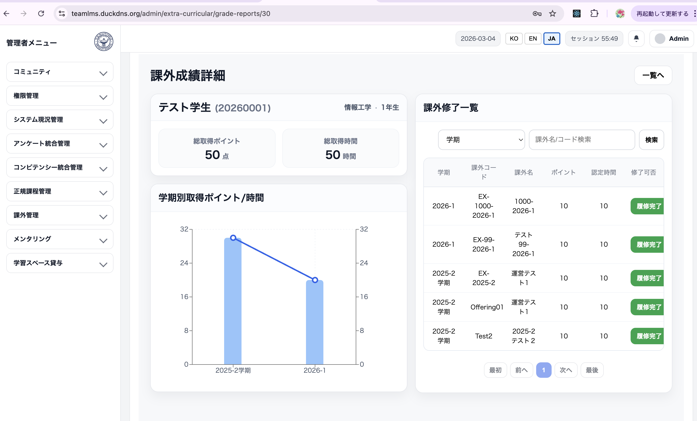

# Team-LMS Portfolio

> （公共SI想定）**管理者 / 学生 / 教員向け LMS プラットフォーム**のチームプロジェクト・ポートフォリオです。  
> ソースコード本体は **チームOrgリポジトリ** にあり、本リポジトリは **デモ / ドキュメント / 自分の担当範囲** を整理したハブです。

## Service (Live)
- https://teamlms.duckdns.org
- 👉 [Demo Accounts](#demo-accounts)

---

## Links
- Org Repository (Source): https://github.com/team-lms-2026-1/LMS-project
- Portfolio Repo (this): https://github.com/Swethous/team-lms-portfolio
- Figma (prototype, view-only): https://www.figma.com/proto/RxRjps2RteNVlH6J0vTxx9/Team-LMS-FIGMA-?node-id=17-20&t=CECAPJa6TQnkEFcM-1
- Use Case Diagram (draw.io): https://drive.google.com/file/d/1vGpn3qZlbVyoDKWs38B_-1B4RwdgZc89/view?usp=sharing

---

## Demo Video

---

## Screenshots
| Auditing Logs (Index) | Auditing Logs (Detail) | MBTI AI Advisor (Result) |
|---|---|---|
|  |  |  |

| Extra-curricular (Offering) | Extra-curricular (Session) | Extra-curricular (Grade) |
|---|---|---|
|  |  |  |

---

## My Role / Contribution
### PM / Project Operations
- スケジュール管理とGitHubベース協業（Issues/PR）の運用リード
- CI/CDパイプライン構築・運用（Backend中心のBuild/Deploy自動化）
- ブランチ戦略 / PRテンプレ / レビュー基準の整備による協業プロセス標準化
- API/設計ドキュメント体系化（`docs/api` 構成整理とドメイン別仕様管理）

### Architecture / Data Design
- ERD設計を主導し、ドメイン境界・リレーション定義
- 公共SI観点の標準（状態管理/削除方針/監査ログ）を策定

### Platform Standards (Backend / Frontend)
- Backend共通基盤：認証/ログイン、RBAC、BaseEntity（監査カラム）、監査ログ
- Frontend共通基盤：Next.js構成標準化、BFF/APIレイヤー、共通コンポーネント/クライアント設定
- i18n標準：UI + API（`Accept-Language`）+ DB-level i18n（MBTIドメイン） + エラーメッセージ方針
- API標準：レスポンス形式（`data/meta`）、エラーコード、ページング規約

### 担当ドメイン（設計・実装）
- 権限管理 / システム管理 / 正課管理 / 課外活動（Extra-curricular）/ MBTI AI Advisor

---

## Team & Collaboration
- チーム規模：5名（PM / Backend / Frontend）
- 開発プロセス：GitHub Issues + PRレビュー、featureブランチ運用、レビュー・チェックリスト
- 自分の担当：PM + プラットフォーム標準化 + 主要ドメインオーナー
- ドキュメント：`docs/api` に **API仕様テンプレ/記述ルール** を整備し、更新をリード

---

## Background
- 目的：ADMIN/PROFESSOR/STUDENT の役割分離と、監査（Audit）を前提に運用できるLMSを構築
- 方針：状態管理/ログ/多言語/API規約など **予測可能な標準化** により保守性・拡張性を確保
- デモ範囲：Security+i18n / Auditing Logs / Extra-curricular Workflow / MBTI AI Advisor

---

## Architecture

Runtime Flow: **Nginx → Next.js(BFF) → Spring Boot → RDS/S3/OpenAI**
- Nginx：SSL終端(443) + reverse proxy
- Next.js：UI + BFF（Route Handlers）で通信を集約
- Spring Boot：`@PreAuthorize` による最終認可 + audit/logging
- RDS：運用DB / S3：ファイル保存 / OpenAI：AI Advisor

---

## Tech Stack

### Backend
| 技術 | バージョン | 採用理由 |
|---|---:|---|
| Java | 17 | LTSベースの安定ランタイム |
| Spring Boot | 3.5.9 | 標準的なバックエンドフレームワーク |
| Spring Data JPA | - | JpaRepository + 派生メソッド + `@Query` でCRUD/検索を実装 |
| Querydsl | - | 複雑検索/動的条件に選択適用 |
| Spring Security + JWT | - | Stateless認証 |
| RBAC (2-layer) | - | URL Role + Method Authority の二重制御 |
| PostgreSQL | - | 運用に強いRDB |
| Flyway + ddl validate | - | マイグレーション/スキーマ検証でデプロイ安定化 |
| AWS S3 (Presigned URL) | - | ファイルUpload/Download |
| Spring AI + OpenAI | gpt-4o-mini | MBTI推薦AI（schema制約 + fallback） |
| OpenAPI (Swagger UI) | - | APIドキュメント/テスト（協業効率向上） |

### Frontend / BFF
| 技術 | バージョン | 採用理由 |
|---|---:|---|
| Next.js (BFF) | 14.2.5 | BFFとしてAPI集約/認証処理 |
| HttpOnly Cookie Auth | - | トークン露出を最小化 |
| next-intl | - | 多言語（ko/en/ja） |
| Chart.js / Recharts | - | ダッシュボード/統計可視化 |

### Infrastructure / DevOps
| 技術 | バージョン | 採用理由 |
|---|---:|---|
| AWS EC2 | - | サービスホスティング（単一サーバ） |
| Nginx + Let's Encrypt | - | HTTPS(SSL終端) + Reverse Proxy |
| AWS RDS (PostgreSQL) | - | 運用DB |
| AWS S3 | - | ファイル保存（Presigned URL） |
| Docker | - | コンテナ実行/配布 |
| Docker Compose | - | ローカル再現性 |
| GitHub Actions | - | デプロイ自動化（Backend中心） |

---

## Project Scope (Team)
- Auth & RBAC
- Admin: Account / Department / Semester administration
- Curricular
- Extra-curricular
- Mentoring
- Community: Notice / Resources / FAQ / QnA
- Surveys
- Competency diagnosis & dashboard
- MBTI & AI Advisor
- Study space rental
- Notifications (Alarm)
- MyPage
- System status & log export

> Demo video focus: Security+i18n → Auditing Logs → Extra-curricular Workflow → MBTI AI Advisor

---

## Problem Solving / Technical Highlights (My Contribution)
- **Presigned URLで課外活動動画Uploadのボトルネック解消**
  - サーバ中継をやめ、S3 Presigned URLでブラウザ直接Uploadに変更
  - `IN_PROGRESS` のみ許可、`video/mp4` allowlist + 有効期限(5分)で運用安定性を確保

- **DBレベルi18n設計でMBTI品質を改善**
  - `mbti_question_i18n`, `mbti_choice_i18n`, `interest_keyword_master_i18n`, `job_catalog_i18n`
  - `(original_id, locale)` のユニーク制約/インデックスで一貫性と拡張性を確保

- **MBTIの多言語をEnd-to-Endで統合（UI → BFF → Backend）**
  - locale（ko/en/ja）を基準に質問/選択肢/キーワード/職種名/推薦理由まで同一言語で返却
  - 欠損時はデフォルト言語fallbackで空白を防止

- **AI推薦の信頼性：Structured Output + Retry + Fallback**
  - JSONスキーマ（5件固定/重複禁止/候補外コード禁止）で検証
  - 失敗時はリトライ後、テンプレfallbackに切替

- **状態遷移ルール化で運用ミス防止（Extra-curricular）**
  - `DRAFT → OPEN → ENROLLMENT_CLOSED → IN_PROGRESS → COMPLETED` の単方向のみ許可
  - 不正遷移はドメイン例外で遮断

- **完了時点の整合性検証とPASSED/FAILED自動確定**
  - `COMPLETED` でポイント/認定時間を検証し、条件を満たした場合に結果を確定

- **BFF + 2-layer RBACで認証/認可の複雑度を削減**
  - Next.js BFFでAPI呼び出しを集約し、HttpOnly Cookieでトークン露出を抑制
  - Backendは URL Role + Method Permission（`hasAuthority`）で二重防御

---

## Proof (Key PRs)
> 代表PR一覧です（詳細な設計意図・背景は本リポジトリのREADME/Docsに整理しています）。

- CI baseline（GitHub Actions） — https://github.com/team-lms-2026-1/LMS-project/pull/1
- Auth/JWT + RBAC（権限モデル導入） — https://github.com/team-lms-2026-1/LMS-project/pull/42
- Logging基盤（Interceptor / AccessLog / ActivityLog / Export Service） — https://github.com/team-lms-2026-1/LMS-project/pull/91
- Extra-curricular 基盤ワークフロー（運営/申請/状態管理） — https://github.com/team-lms-2026-1/LMS-project/pull/147
- Extra-curricular 拡張（成績/完了処理/学生・管理者ビュー） — https://github.com/team-lms-2026-1/LMS-project/pull/163
- MBTI AI Advisor refactor（Recommendation service/client） — https://github.com/team-lms-2026-1/LMS-project/pull/232
- i18n + MBTI/AI連携（job_catalog_i18n seed含む） — https://github.com/team-lms-2026-1/LMS-project/pull/237

---

## ERD
- 詳細ERD: [ERD 詳細を見る](docs/ERD.md)

---

## Demo Accounts
> デモ用アカウントです。パスワードは運用上変更される場合があります。

- **Admin**: `a20001122` / `Admin!2345`
- **Professor**: `p20260001` / `Professor!2345`
- **Student**: `s20260001` / `Student!2345`