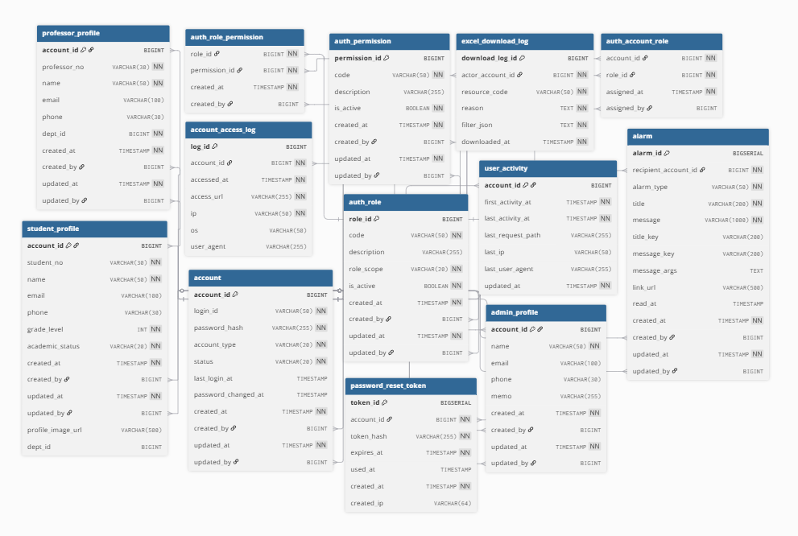
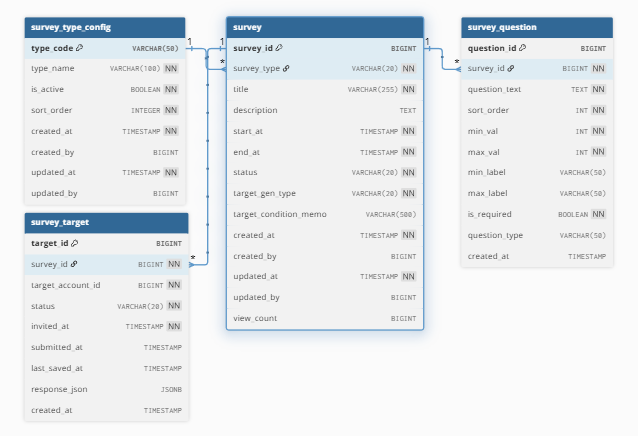
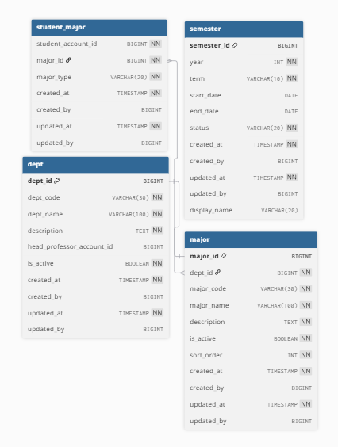

# ERD 詳細

Team-LMS のドメイン別 ERD です。

## Accounts / Permissions / Notifications

## Curricular

## Extracurricular

## Mentoring

## Survey

## Diagnostic Assessment

## Community

## Department / Semester

## Learning Space

## MBTI AI Advisor

